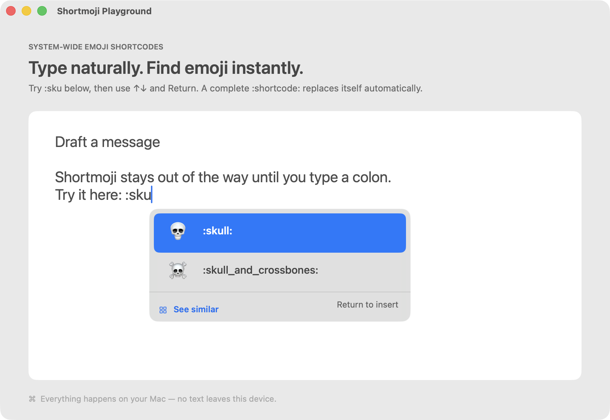

# Shortmoji

**Discord-style emoji shortcodes, across your Mac.**

Shortmoji is a small native macOS menu-bar utility that turns `:skull:` into 💀 while you type. A compact suggestion panel appears near your cursor, helping you find emoji by name, alias, or related meaning without leaving your text field.



## Features

- Type a prefix such as `:sku` to open related emoji suggestions.
- Use Up/Down to select and Return or Tab to insert.
- Type a complete shortcode such as `:skull:` to replace it immediately with 💀.
- Search uses names, aliases, related keywords, and light fuzzy matching.
- Click **See similar** to browse related emoji in a compact grid, then type to search the bundled catalog.
- Choose **All emoji** or a category in the grid to browse the full catalog. Scroll through skin tones, flags, families, professions, and other variants; hover a tile to see its full shortcode.
- Navigate the grid with arrow keys; press Return or Tab to insert. Backspace edits the search, and Escape clears it or returns to suggestions.
- Native AppKit materials, system emoji, and a quiet menu-bar presence.
- Text stays local; the app has no network code.

Shortmoji needs macOS Accessibility access to observe global typing and insert the selected emoji. The packaged app uses a stable local designated requirement so this permission survives rebuilds.

## Download and install

Download the DMG from [Releases](https://github.com/roxvihaan/Shortmoji/releases), open it, and drag **Shortmoji.app** onto **Applications**. Launch Shortmoji and follow the Accessibility prompt. Its menu-bar menu also includes a playground for trying shortcodes.

**Requirements:** Apple Silicon Mac, macOS 14 Sonoma or later.

This initial release is locally signed and **not notarized by Apple**. macOS may block the first launch. If you trust the download, review the blocked-app notice in System Settings → Privacy & Security and choose Open Anyway.

## Privacy and limitations

Shortmoji observes keyboard input locally to recognize shortcodes and uses Accessibility plus clipboard-based insertion to replace text. It does not send typed text to a server. Support depends on the target app; secure fields and apps that intercept keyboard input may not work.

The bundled catalog contains **3,953 emoji and variants**: every fully qualified emoji and emoji component in the [Unicode Emoji 18.0 test data](https://www.unicode.org/Public/emoji/latest/emoji-test.txt) that renders as a single emoji on the build Mac (macOS 26.5.1). The font check allows overlaid glyphs used by mixed-tone sequences while rejecting missing glyphs and sequences that fall apart into separate symbols. This is standard Unicode emoji coverage, not stickers, custom Discord emoji, or Genmoji. Older macOS versions may render fewer entries.

Existing aliases come from [GitHub’s gemoji data](https://github.com/github/gemoji) and Shortmoji’s curated keywords. Both upstream licenses are bundled with the app.

### Background work and power

An event-driven keyboard listener stays registered to recognize `:`. It does not poll on a timer or search the catalog during ordinary typing. The catalog and precomputed search index load on the first shortcode search, then remain cached in memory. Search begins after `:` plus a character; caret lookup and popup updates only run during an active query. The category grid recycles visible rows rather than creating thousands of tiles. This reduces unnecessary work; it is not a measured battery-life guarantee.

## Development

Requires Xcode with the macOS SDK and Node.js. No npm dependencies are needed.

```sh
npm test        # Search, shortcode state, and native interaction regression tests
npm run build  # Build and sign release/Shortmoji.app
npm run dmg    # Build a versioned drag-to-install DMG
```

The DMG script refuses to overwrite an existing versioned installer. Release binaries belong in GitHub Releases, not the source repository.

Built with Swift and AppKit using Swift Package Manager. Source is in `Sources/`, regression tests in `Tests/`, and packaging scripts in `scripts/`.

To refresh coverage for another macOS build, download Unicode's `emoji-test.txt`, run `xcrun swift scripts/check-emoji-support.swift emoji-test.txt supported.json`, then `node scripts/import-unicode.mjs emoji-test.txt supported.json`. This uses the installed Apple Color Emoji font and retains existing shortcode aliases.
